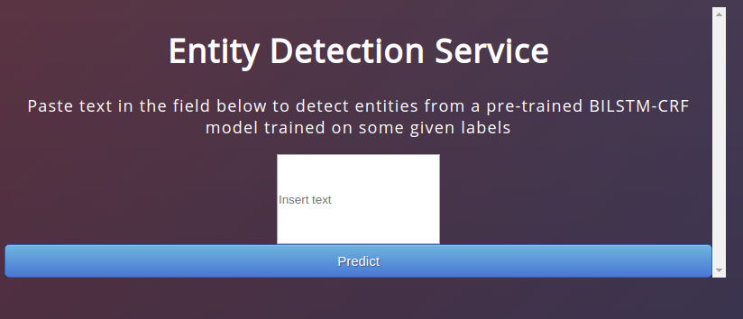
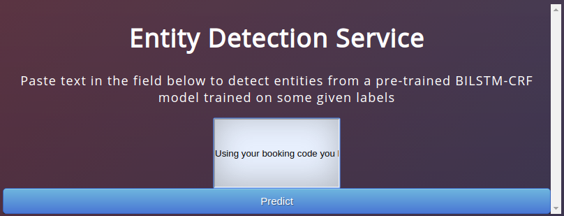
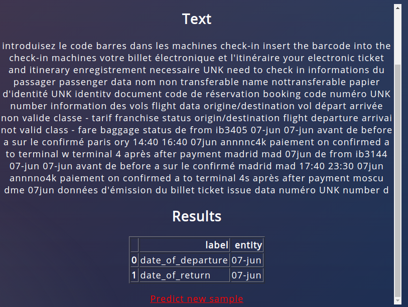
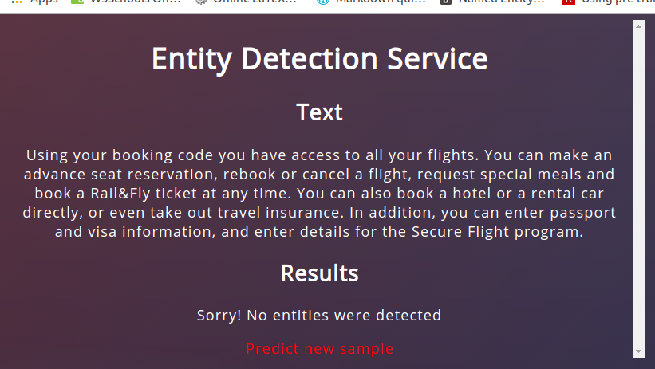

# Learnings-from-deploying-a-NLP-flask-api

## Prediction Service : 
The idea of this project was to learn steps which are needed to deploy an application which can be used by any user (not only locally). This `FLASK api` provides a pre-trained `NLP model` written in `pytorch`. The end result is -  

* Paste text in the browser from which the entites have to be extracted.

* The browser GUI runs a pre-trained model to detect entites. Press `predict` button to run prediction using the backened `BILSTM-CRF` model

* Results containing detected entities and their labels are displayed in the browser

* If no entities found : 

## Model outline : 

