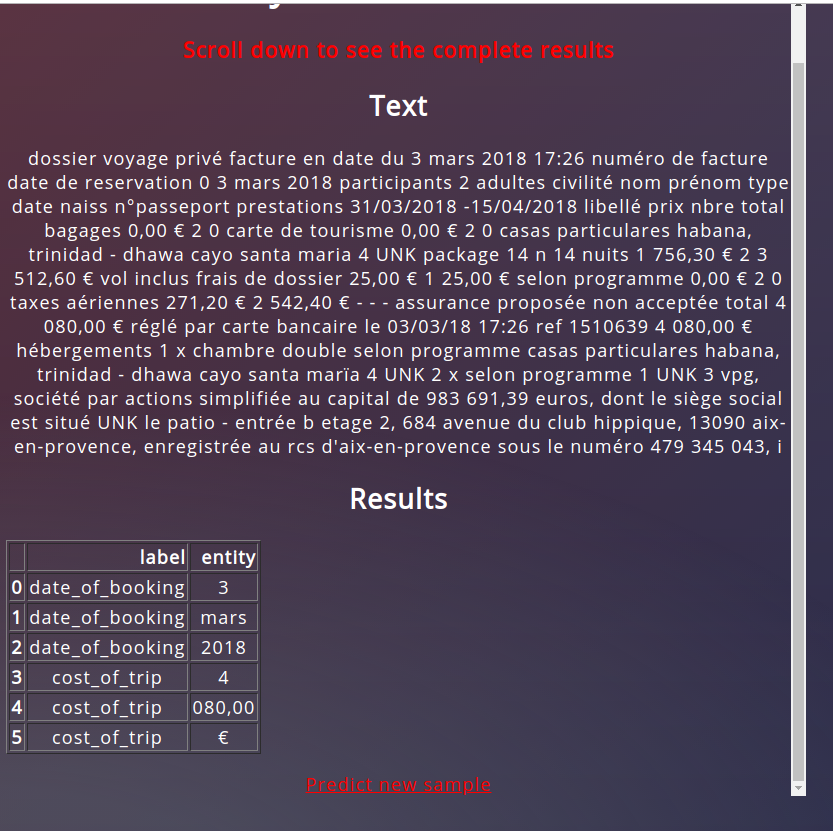

# Learnings-from-deploying-a-NLP-flask-api

## Prediction Service : 
The idea of this project was to learn steps which are needed to deploy an application which can be used by any user (not only locally). This `FLASK api` provides a pre-trained `NLP model` written in `pytorch`. The end result is -  

#### 1. Paste text in the browser from which the entites have to be extracted.

#### 2. The browser GUI runs a pre-trained model to detect entites. Press `predict` button to run prediction using the backened `BILSTM-CRF` model

#### 3. Results containing detected entities and their labels are displayed in the browser

#### If no entities found : 

## Model outline : 

The aim is to deploy the application as a service using Flask and share the working browser application as a running container  of a docker image, hence can be used by a remote client with ease. In doing so, I gained some insights which can be useful in developing such an application from Data Science and Backend perspective which are presented below.  

The three major elements of this application are:
## **NLP model**
When the flask application server starts, the first step before ready to render `index.html` is to `initialize` and `load` the pytorch NLP model. Key pointers :
  * Always save the `configuration` used to run training of `model` (which will be used for prediction).  Else loading from `state_dict()` becomes hard if parameters are not saved e.g. `hidden_dim`, `embedding_dim`, `num_layers` etc.
  * Logic to handle out-of-vocaulary-words in the neural network model itself. (e.g. random initialization or using fasttext embeddings)
  * How to load word embeddings `model.bin` file in a container if using `Gensim`?. (from the way I used `Gensim`, locally trained `Fasttext` embeddings from a `.bin` file is to copied to the `Gensim site-packages` in python environment. NOT GOOD PRACTICE as doing this in in docker-image is probably not possible). 
  
## **Flask app**
* Learned about how variables from html placeholders can be loaded using `request.form.get('<PLACEHOLDER>)`.
* Since `model()` is initialized and loaded before the flask-app starts, one app.py can run only one kind of model.
* To add multiple models into one application, branch out using HTML templates and Flask routes. 
## **Running as a Container - Docker**
* While creating an image, running `pip install -r requirements.txt` (in `Dockerfile`) leads to a lot of conflicts among dependencies. Learn about practices Engineers use to handle this 
